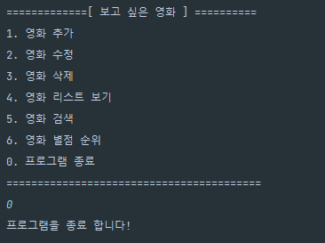

<h1>보고 싶은 영화 CRUD</h1>
<ol>
  <li><h2>프로그램 파일 설명</h2></li>
    <ol>
      <li>Main: 프로그램이 실행되는 클래스</li>
      <li>Movie: 프로그램에서 사용되는 객체를 정의한 클래스</li>
      <li>CRUD: 객체를 사용하여 CRUD 및 기타 기능을 수행하는 클래스</li>
    </ol>  
  <li><h2>사용된 라이브러리</h2>
   <ol>
      <li>BufferedReader</li>
      <li>IOException</li>
      <li>InputStreamReader</li>
      <li>LocalDate</li>
      <li>DateTimeFormatter</li>
      <li>ArrayList</li>
      <li>Collections</li>
      <li>Comparator</li>
      <li>List</li>
    </ol>  

  </li>
  <li><h2>프로그램 실행 화면 및 설명</h2></li>
     <ol>
       <li>프로그램 실행 
          
         </li>
       <li>영화 추가 Create 
       
         </li>
       <li>영화 리스트 보기 Read 
       
         </li>
       <li>영화 수정 Update 
        
         </li>
        <li>영화 삭제 Delete 
        
          </li>
       <li>영화 검색 Search 
        
영화 이름으로 검색

       
       
영화 장르로 검색

       
         </li>
       <li>영화 평점순으로 정렬 Sort 
        
         </li>
        </li>프로그램 종료 Exit 
       
        </li>
     </ol>  
</ol>
