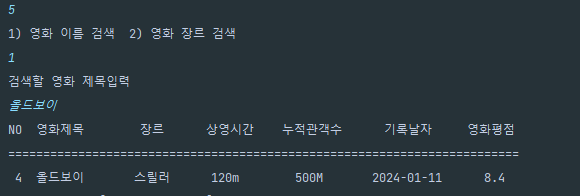
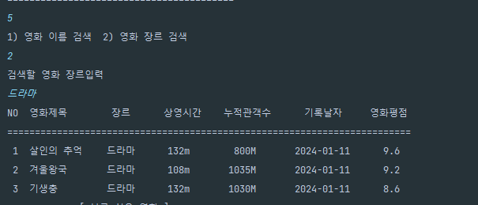

<h1>보고 싶은 영화 CRUD</h1>

참고 홈페이지는 영화관 홈페이지 메가박스를 참고하여 작성하였습니다.<a = href= "https://www.megabox.co.kr/movie"> CRUD 참고 링크 홈페이지</a>

<h5>WALAB_Project3는 WALAB_Project1에서 데이터 베이스를 연결하여 CRUD기능을 구현하였습니다.</h5>
<ol>
  <li><h2>프로그램 파일 설명</h2></li>
    <ol>
      <li>org.example.CRUD: CRUD를 구현하는 클래스</li>
      <li>org.example.DDLService: DDL이 작동하는 클래스, 테이블이 없다면 생성</li>
      <li>org.example.DMLService: DML이 작동하는 클래스, </li>
      <li>org.example.DQLService: DQL이 작동하는 클래스, </li>
      <li>org.example.Main: 모든 클래스들을 사용하여 프로그램이
        작동하는 Main클래스</li>
      <li>org.example.Menu: 메뉴를 출력하는 클래스</li>
      <li>org.example.Movie: 프로그램에서 사용되는 객체를 정의한 클래스</li>
      <li>org.example.SearchService: 검색 기능이 있는 서비스 (제목 ,장르)</li>
      <li>org.example.SQLiteManager: SQL connection을 확인하는 클래스</li>
    </ol>  
  <li><h2>사용된 라이브러리</h2>
   <ol>
      <li>BufferedReader</li>
      <li>IOException</li>
      <li>InputStreamReader</li>
      <li>LocalDate</li>
      <li>DateTimeFormatter</li>
      <li>java.util.* </li>
           <ol>HashMap</ol>
           <ol>Map</ol>
      <li>java.sql.* </li>
            <ol>Connection</ol>
            <ol>PreparedStatement</ol>
            <ol>SQLException</ol>
            <ol>DriverManager</ol>
            <ol>SQLException</ol>
      <li>lombok</li>
            <ol>getter</ol>
            <ol>setter</ol>
   </ol>  

  </li>
  <li><h2>프로그램 실행 화면 및 설명</h2></li>
     <ol>
       <li>프로그램 실행 
          
         </li>
       <li>영화 추가 Create 
       
         </li>
       <li>영화 리스트 보기 Read 
       
         </li>
       <li>영화 수정 Update 
        
         </li>
        <li>영화 삭제 Delete 
        
          </li>
       <li>영화 검색 Search 
        
영화 이름으로 검색

       
       
영화 장르로 검색

       
         </li>
       <li>영화 평점순으로 정렬 Sort 
        
         </li>
        </li>프로그램 종료 Exit 
       
        </li>
     </ol>  
</ol>
